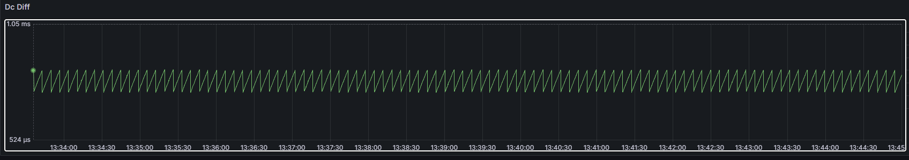
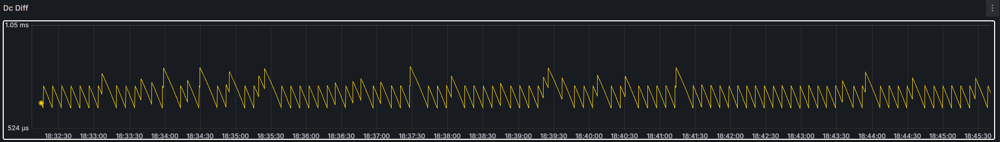

# ✨ WMX Machine Learning: Anomaly Detection

WMX analytics shows peculiar patterns in data gathered from WMX masters.

Using the data (especially the DC diff), a new model is trained to detect anomalies from the analytic data of other systems.

## Prerequisites
Note that the Python environment where this notebook runs should already have **PyTorch** packages.

```sh
pip install scipy
pip install pandas
pip install seaborn
pip install -U scikit-learn
pip install -q -U watermark
pip install datasets
pip install huggingface-hub
pip install ipywidgets
```

## Datasets

### Normal datasets
**Normal DC diff** data for deep learning training can be loaded from the following the hugging face link. 

https://huggingface.co/datasets/Jake5/wmx_normal_data



### Abnormal datasets
**Anomaly DC diff** data can be found as well from below link.

https://huggingface.co/datasets/Jake5/wmx_abnormal_data


